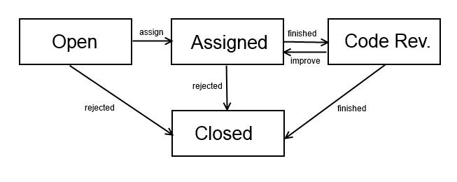

# Contributing to FHOOEAIST

Thanks for considering to contribute your changes to one of our projects. We are grateful for your support!

The following is a set of guidelines for contributing to the these projects and its packages,
which are hosted in the FHOOEAIST organization on GitHub. These are mostly guidelines, not rules (except style guides and review process, these are absolutely rules). Use your best judgment,
and feel free to propose changes to this document in a pull request.

Please note that the research group [AIST](http://aist.science) is exclusively financed via external funding, and thus we have no dedicated employees or work hours for the open source projects at GitHub. Most of our contributors provide their work in their free time. Many contributors are students doing this to get acquainted with open source or to add features they want for their thesis. We will make a best effort, but no guarantees, to work on pull requests where you provide code and bug fixes for bug reports. For new features this is exclusively up to the availability and interest of contributors, and in no way, shape or form do we guarantee anything getting done in a specific timeframe (or at all).

- [Contributing to FHOOEAIST](#contributing-to-fhooeaist)
  * [Code of Conduct](#code-of-conduct)
  * [How Can I Contribute?](#how-can-i-contribute)
    + [Reporting Bugs](#reporting-bugs)
    + [Submitting Enhancements and Feature Requests](#submitting-enhancements-and-feature-requests)
    + [How do I contribute code](#how-do-i-contribute-code)
    + [The issue lifecycle](#the-issue-lifecycle)
    + [The review process - Pull Requests](#the-review-process-pull-requests)
      - [For the implementers (before merge request):](#for-the-implementers-before-merge-request)
      - [For reviewers:](#for-reviewers)
  * [Issue and Pull Request Labels](#issue-and-pull-request-labels)
  * [Style guides](#style-guides)
    + [Git Commit Messages](#git-commit-messages)
    + [Code Style](#code-style)
    + [Documentation Style](#documentation-style)
    + [Source code documentation](#source-code-documentation)

## Code of Conduct

This project and everyone participating in it is governed by the [Contributor Covenant Code of Conduct](CODE_OF_CONDUCT.md). By participating, you are expected to uphold this code. Please report unacceptable behavior to `contact@aist.science`.

## How Can I Contribute?
There are multiple ways of how one can contribute:
- By reporting bugs
- By suggesting enhancements or new features 
- By contributing code and making pull requests 

### Reporting Bugs

- Please make sure if there isn't already an open or closed github issue in the corresponding repository for the problem that you are facing.
- In order to create a good bug report you will be asked to fill out a couple of questions concerning your bug, which are necessary for the contributors to address the stated problem most effectively.  

| Bug Criteria | Description |
| --- | --- |
| Describe the bug | A clear and concise description of what the bug is. |
| To Reproduce | Steps to reproduce the behavior. |
| Expected behavior | A clear and concise description of what you expected to happen. |
| Optional Real Submitter | Who ist the real submitter, in case the creation of the issue was done by proxy. |
| Optional Link| Links to additional information that can help the contributor understand more about this issue. |
| Optional Priority | Priority of this request (Critical, Major, Minor, Trivial; we have labels for blocker and hot). |

### Submitting Enhancements and Feature Requests

- In order to create a good feature request you will be asked to fill out a couple of questions concerning your request, which are necessary for the contributors to address the desired feature most effectively.

| Request Criteria | Description |
| --- | --- |
| Is your feature request related to a problem? Please describe. | A clear and concise description of what the problem is. |
| Describe the solution you'd like | A clear and concise description of what you want to happen. |
| Describe alternatives you've considered | A clear and concise description of any alternative solutions or features you've considered. |
| Additional Context | Any other context or screenshots about the enhancement or feature request. |
| Optional Real Submitter | Who ist the real submitter, in case the creation of the issue was done by proxy. |
| Optional Link| Links to additional information that can help the contributor understand more about this issue. |
| Optional Priority | Priority of this request (Critical, Major, Minor, Trivial; we have labels for blocker and hot). |

### How do I contribute code

Unsure where to begin contributing? You can start by looking through the `good first issue` issues. Before doing so, you might want to familiarize yourself with the project. All of them have a "Getting Started" section that you can use to build and use the project. 

Most of our core contributors work in academia and are used to guiding junior students into new projects. So if you have any questions, need help, or just don't know where to start, feel free to drop us a mail.

### The issue lifecycle

* open [-]: an issue (see above) that is NOT assigned
  * open [suggested]: an issue that is not yet accepted by the development team and needs to be discussed (optional)
  * open [confirmed]: an issue that was triaged and accepted by the development team
* assigned [-]: issue assigned to a person.
  * assigned [suggested]: assignee checks if the issue is valid, either rejects issue or sets it to confirmed
  * assigned [confirmed]: issue development is in progress
* in code review [review]: issue is beeing reviewed (see "Review process"). Dev != Reviewer
* closed [-|rejected]: issue is finished (default), or not accepted [rejected].

### The review process - Pull Requests

We work with feature branches, meaning that per default we don't review individual issues, but rather look at a feature as a whole.
Only in special cases an issue will be reviewed on its own.

We are never merging code we use *rebase*. The pull request for code reviews is opened by the developer and is done on one branch on top of the master branch. Please note that before opening a merge request for review, all issues must be tackled in ONE branch and all issues in that branch must be finished before this pull request can be reviewed.

* Before opening the request make sure that the branch you want to merge is already REBASED on the master
* A reviewer will review your code in the request, and open discussions at the appropriate points in code
* You can add commits that address the discussions and also add comments to the discussion using the corresponding issue number
* When the reviewer has closed all discussions (do NOT close the discussions yourself) the branch is ready to be fast-forwarded by the reviewer
* If the remote master has changed since your last rebase, you have to do another rebase

#### For the implementers (before merge request):

- Check if the functionality of the issues is there
- Check if all functionality comes with appropriate tests
- Check if the [Style guides](#style-guides) are implemented
- Check if the project builds, and if all tests succeed

#### For reviewers:
- Check if the functionality of the issues is there
- Check if all functionality comes with appropriate tests
- Check if the development guidelines are implemented
- Check if the project builds, and if all tests succeed **(also on our CI to avoid plattform specific errors)**
- Check open sonar issues
- We only allow fast-forward merges
- We only allow merges if all discussions are resolved

## Issue and Pull Request Labels

**Issue Type**

| Label name | Description |
| --- | --- |
| `bug` | Bug in project |
| `documentation` | Improvements or additions to documentation |
| `good first issue` | Good for a newcomer to get started in the project |
| `hot` | This is currently a hot topic and should be worked on soon |
| `optimization` | This is an improvement of an existing feature |
| `story` | This is a Story summarizing several issues into an overarching feature |

**Issue Lifecycle**

| Label name | Description |
| --- | --- |
| `blocked` | This issue is blocked by another issue (corresponds with blocker) |
| `blocker` | This issue is blocking another issue (corresponds with blocked) |
| `suggested` | New feature or improvement suggested to be added |
| `confirmed` | Issue has been confirmed by contributor to be added to project (replaces suggested) |
| `duplicate` | This issue is a duplicate of another issue |
| `rejected` | This issue has been rejected and will not be worked on |
| `review` | This issue is ready to be reviewed |

## Style guides

### Git Commit Messages

A commit message must start with the corresponding ticket number in GitHub (#TICKETNUMBER) each commit message must have a description which should be in present tense and use imperative voice.

### Code Style 

For Code Style please refer to the [Coding Conventions](CodingConventions.md)

### Documentation Style

If the maven site plugin is used, the documentation should be inside the src/site/markdown folder again done in markdown files. This then allows to autogenerate a documentation page, which is cohosted to the javadoc of the according projects [here](https://fhooeaist.github.io/). Documentation can be written in any Doxia compatible markdown language as long as the according plugin is configured. More information on this can be found [here](https://maven.apache.org/doxia/references/). 

### Source code documentation 

* Source code is commented using single or multi-line comments in English
  * Auto-Generated code does not need to be commented (and comments will likely be overwritten on another auto-generation!)
* Only sourcecode and abstract testclasses / need to have comments. Testclasses do not need comments.
* Classes must be annotated (in IntelliSense or IntelliJ) with:
  * The Author
  * A Short description of what the file is for
  * Copyright declaration
  * If an existing class is changed signifcantly add a co-author to the class
    * You may also want to add commentary to the class concerning new and removed features (e.g. in Java @since; @deprecated)
* Fields should have a comment describing their content
* Getters and Setters of fields should have a similar description as their corresponding private fields
* Methods are to be commented with:
  * a short description of their functionality
  * the needed input,
  * the expected results.
  * for collections always mention if they return null or an empty collection
  * Always document the thrown errors
  * Generally, comments on public methods are more important than those on private methods
* In Code Comments are to be made at the developers discretion
  * The longer the method, the more comments are to be expected
  * It may be better to split methods that are too long ;)